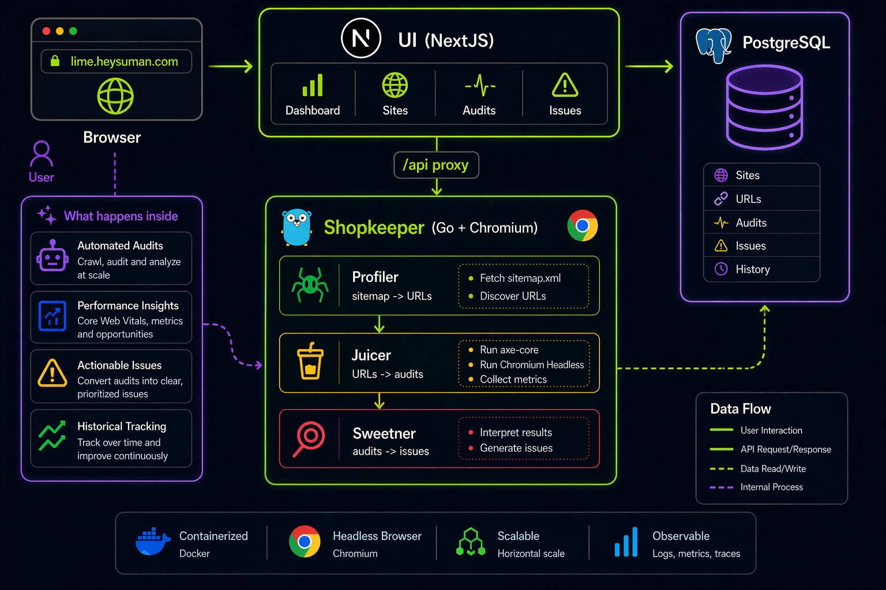

<div align="center">


# LIME

**Self-hosted accessibility scanner powered by axe-core.**
Scan sitemaps, capture screenshots, review issues in a dashboard.

[](https://github.com/sumanbasuli/lime/releases)
[](COPYING)
[](https://github.com/sumanbasuli/lime/pkgs/container/lime-shopkeeper)
[](https://github.com/sumanbasuli/lime/pkgs/container/lime-ui)

[Quick start](#quick-start) | [Deploy](#deploy) | [Docs](https://sumanbasuli.github.io/lime/) | [Roadmap](https://sumanbasuli.github.io/lime/roadmap/) | [Releases](https://github.com/sumanbasuli/lime/releases)

</div>

---

## What is LIME?

LIME is a batteries-included accessibility scanner you host yourself. Point it at a sitemap or a URL, it walks the pages with a headless Chromium, runs the full axe-core ruleset (WCAG A/AA, Lighthouse-aligned), captures focused screenshots of each violation, and groups the results into reviewable issues with ACT rule guidance.

Built to be cheap to run on a small server, straightforward to push to Fly.io, and safe to leave alone. Migrations apply on boot, interrupted scans recover on restart, and updates are one command.

## Features

- **Full-site scans** driven by sitemap or sitemap-index, with viewport presets (desktop / laptop / tablet / mobile).
- **Per-issue screenshots** - highlighted visible capture + inline preview, spotlight overlay, focus/hover settle pass.
- **Axe-core + ACT** - Lighthouse-aligned rule set, ACT catalog bundled locally (no runtime W3C calls).
- **Reports** - PDF, CSV, and compact LLM-ready exports per scan or issue.
- **False-positive triage** flag per issue.
- **Partial scan retry** - retry failed pages inside the same scan without creating a second scan.
- **Scan recovery** - non-terminal scans resume after Shopkeeper restarts.
- **Update notice** - opt-in sidebar banner when a new GitHub release is available.
- **Three deploy targets** - Fly.io, Docker, and Linux systemd.

## Architecture



- **[Shopkeeper](shopkeeper/)** - Go backend. Chi router, pgx, golang-migrate. Owns scan lifecycle, API routes, migrations, screenshots, PDFs, and the internal scan pipeline.
- **[UI](lime/)** - NextJS App Router, shadcn/ui, Drizzle ORM. Reads Postgres directly for server-rendered pages, proxies `/api/...` to Shopkeeper at runtime so the image stays generic.
- **Database** - PostgreSQL 17 shared by both services.

Shopkeeper pipeline:

| Stage | What it does |
|-------|--------------|
| **[Profiler](https://sumanbasuli.github.io/lime/docs/architecture/profiler/)** | Expands sitemap and sitemap-index inputs into a validated, deduplicated URL set for the scan. |
| **[Juicer](https://sumanbasuli.github.io/lime/docs/architecture/juicer/)** | Takes those URLs, drives Chromium workers, runs axe-core, captures screenshots, and records per-page audit outcomes. |
| **[Sweetner](https://sumanbasuli.github.io/lime/docs/architecture/sweetner/)** | Takes Juicer audit output and writes normalized issues, occurrences, audits, and review-required records. |

Full architecture docs: [sumanbasuli.github.io/lime/docs/architecture/shopkeeper](https://sumanbasuli.github.io/lime/docs/architecture/shopkeeper/).

## Quick start

```bash
git clone https://github.com/sumanbasuli/lime.git
cd lime
cp .env.example .env
make start-all
```

Open:

- **UI** - <http://localhost:3000>
- **API** - <http://localhost:8080/api/health>

Stop: `make stop-all`. Reset volumes: `make clean`.

## Deploy

LIME publishes versioned Docker images to GHCR from the main-branch release workflow. Use the release tag you want to deploy, for example `v1.0.0`.

| Target | One-liner | Guide |
|--------|-----------|-------|
| **Fly.io** | `./scripts/fly-deploy.sh v1.0.0` | [Fly.io guide](https://sumanbasuli.github.io/lime/docs/deployment/fly/) |
| **Docker** | `docker compose -f docker-compose.release.yml up -d` | [Docker guide](https://sumanbasuli.github.io/lime/docs/deployment/vps-docker/) |
| **Linux systemd** | `make build && sudo ./scripts/vps-install.sh` | [Linux guide](https://sumanbasuli.github.io/lime/docs/deployment/vps-native/) |

### Deploy to Fly.io

Fly Launch is Fly.io's app workflow around `fly launch`, `fly.toml`, and `fly deploy`; see [Fly Launch](https://fly.io/launch) for the platform overview. LIME uses that model, but it is a two-app deployment (Shopkeeper + UI), so do not run a single root-level `fly launch` and expect the whole stack to be configured. Use the included helper instead: `scripts/fly-deploy.sh` creates both apps, provisions screenshot storage, wires private networking, and deploys the published GHCR images.

Before deploying, install [`flyctl`](https://fly.io/docs/flyctl/install/) and authenticate:

```bash
flyctl auth login
```

Use either an external PostgreSQL URL:

```bash
export DATABASE_URL='postgresql://...'
./scripts/fly-deploy.sh v1.0.0
```

Or attach Fly Managed Postgres to both apps first; the helper will reuse existing `DATABASE_URL` Fly secrets. Details: [Fly.io deployment docs](https://sumanbasuli.github.io/lime/docs/deployment/fly/).

### Updating

Every deploy target ships an update command that backs up the database, pulls the new version, migrates, and rolling-restarts the services.

```bash
./scripts/fly-update.sh v0.2.0            # Fly.io
make update-release TAG=v0.2.0            # Docker (release bundle)
sudo ./scripts/vps-update.sh v0.2.0       # Linux systemd
```

Details and rollback: [update docs](https://sumanbasuli.github.io/lime/docs/deployment/updates/).

## Configuration

Runtime configuration lives in `.env` (root) or deploy-specific env files.

| Variable | Required | Description |
|----------|----------|-------------|
| `DATABASE_URL` | yes | PostgreSQL connection string, shared by UI and Shopkeeper. |
| `SHOPKEEPER_URL` | yes | URL the UI proxies `/api/...` to. |
| `LIME_IMAGE_REGISTRY` | release only | GHCR namespace for published images, e.g. `ghcr.io/sumanbasuli`. |
| `LIME_IMAGE_TAG` | release only | GHCR image tag, e.g. `v0.1.0`. |
| `LIME_API_PORT` / `LIME_UI_PORT` | optional | Published ports (defaults 8080 / 3000). |
| `LIME_UPDATE_CHECK` | optional | `true` shows a sidebar card when a newer release is on GitHub. Off by default. |
| `LIME_GITHUB_REPO` | optional | Override the update-check repo (default `sumanbasuli/lime`). |
| `ACT_RULES_PATH` | optional | Override the bundled ACT catalog path. |

See the [setup docs](https://sumanbasuli.github.io/lime/docs/setup/) for the full table.

## Development

```bash
make start-dev           # full Docker stack with UI hot reload
make start-db            # only Postgres
make dev-shopkeeper      # Go backend with Air hot reload
make dev-ui              # NextJS with hot reload
```

| Command | Description |
|---------|-------------|
| `make start-all` | Production-style Docker stack built from source |
| `make start-dev` | Development Docker stack with NextJS hot reload |
| `make migrate-all` | Apply DB migrations |
| `make build` | Build Go + Next + release bundle into `dist/` |
| `make build-docker` | Build versioned Docker images locally |
| `make docs` | Refresh the static docs site with isolated heysuman.com demo screenshots |
| `make docs-run` | Build and serve the static docs site locally |
| `make docs-dev` | Run the docs site with NextJS hot reload |
| `make backup-db` | Dump the bundled Postgres to `dist/backups/` |
| `make update TAG=vX.Y.Z` | Rebuild from a tag and rolling-restart |
| `make clean` | Stop the stack and remove volumes |

## Tech stack

- **Backend**: Go 1.25, Chi, pgx, golang-migrate, chromedp
- **Frontend**: NextJS 16 (App Router), shadcn/ui, Drizzle ORM, TailwindCSS v4
- **Browser**: Chromium (Debian bookworm base image)
- **DB**: PostgreSQL 17

## Docs

Public docs are published at [sumanbasuli.github.io/lime](https://sumanbasuli.github.io/lime/). The repo-local Markdown in [docs/](docs/) remains the source content and contributor fallback.

`make docs` refreshes the docs site locally. It uses a separate `lime-docs` Docker Compose project, separate Postgres and screenshot volumes, non-default ports, and fresh single-page demo scans for `https://heysuman.com`, `https://www.fake-university.com/`, and `https://overlaysdontwork.com/` so it never screenshots current private/local scans.

## Contributing

Issues and pull requests welcome. Before opening a PR:

1. Run `make build`; it must succeed.
2. Keep migrations forward-only and mirror any schema change in [`lime/src/db/schema.ts`](lime/src/db/schema.ts).
3. Document new features in `docs/` first; [`docs/index.md`](docs/index.md) is the source of truth.

See [CONTRIBUTING.md](CONTRIBUTING.md) for development setup, checks, and PR expectations.

## Release Checklist

Maintainers publish a release by updating [VERSION](VERSION), adding matching notes in [CHANGELOG.md](CHANGELOG.md), and merging to `main`. [release-docker.yml](.github/workflows/release-docker.yml) now runs `make build`, publishes the GHCR images through [`scripts/publish-release-images.sh`](scripts/publish-release-images.sh), and creates or updates the GitHub Release through [`scripts/publish-github-release.sh`](scripts/publish-github-release.sh). The release tag must be new; bump `VERSION` for every release.

## Support

Use [GitHub Issues](https://github.com/sumanbasuli/lime/issues) for bugs and deployment questions. Include the deploy target, release tag, relevant logs, and whether the scan was sitemap or single-page.

Security reports should follow [SECURITY.md](SECURITY.md).

## License

LIME is released under the [GNU General Public License v2.0](COPYING). See the `COPYING` file for the full text.
